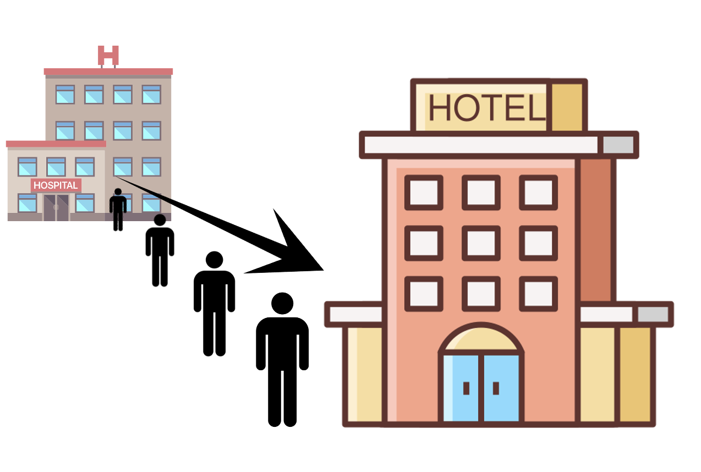

# Seperate-Compilation-C++-Lab

C++ Seperate Compilation Lab Project: Quarantine System.



## Introduction

In this lab, you will learn about seperate compilation through a simple simulation with the theme: Quarantine. By using seperate compilation, you can write your codes on multiple files in order to make it tidier and maintainable in the long run. The number of covid in Hong Kong has been rising significantly for these past few weeks. Let's say you want to help tackling the Covid issue by making a new quarantine hotel. In order to make your quarantine system working, you need to make the program for assigning patient to their room.

## Lab Description
Since your hotel is still new, it is now in a trial period for 10 days, in other words, you will receive patient for maximum of 10 days and each days have 30 patients. For the details of your quarantine hotel, it has 50 rooms and 2 type of rooms: **Single Quarantine** and **Couple Quarantine**


|    | 

# returns 'geese'
foobar.pluralize('goose')

# returns 'phenomenon'
foobar.singularize('phenomena')
```

## Contributing
Pull requests are welcome. For major changes, please open an issue first to discuss what you would like to change.

Please make sure to update tests as appropriate.

## License
[MIT](https://choosealicense.com/licenses/mit/)
