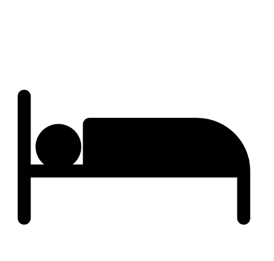
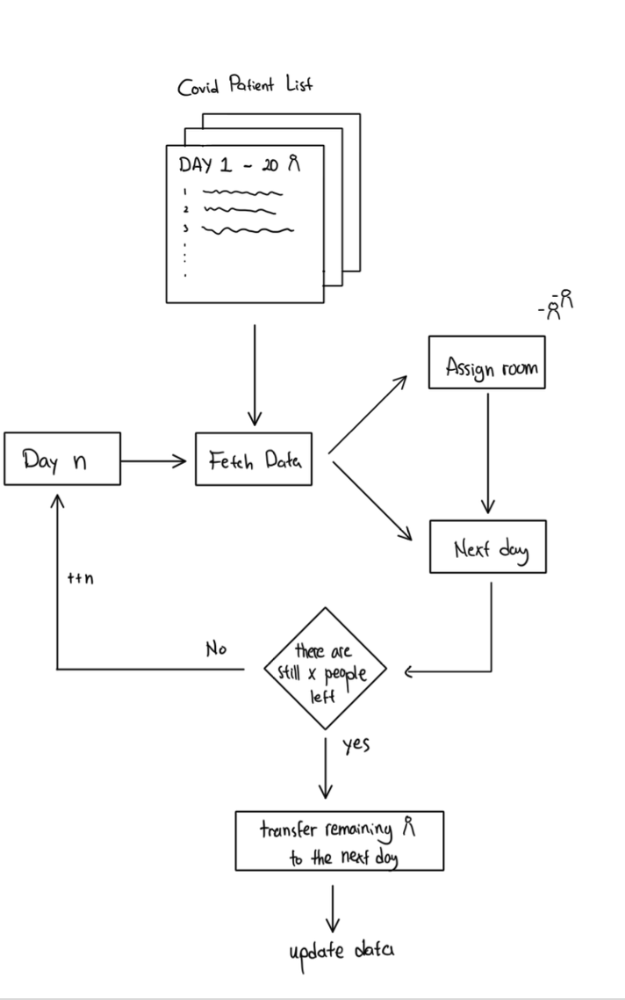

# Seperate-Compilation-C++-Lab

C++ Seperate Compilation Lab Project: Quarantine System.

<p align = "center">
  
</p>

## Introduction

In this lab, you will learn about seperate compilation through a simple simulation with the theme: Quarantine. By using seperate compilation, you can write your codes on multiple files in order to make it tidier and maintainable in the long run. The number of covid in Hong Kong has been rising significantly for these past few weeks. Let's say you want to help tackling the Covid issue by making a new quarantine hotel. In order to make your quarantine system working, you need to make the program for assigning patient to their room.

## Lab Description
Since your hotel is still new, it is now in a trial period for 10 days, in other words, you will receive patient for maximum of 10 days and each days have 30 patients. For the details of your quarantine hotel, it has 50 rooms and 2 type of rooms: **Single Quarantine** and **Couple Quarantine**


|    |     |
|     :---:    |     :---:      |
| Single Quarantine | Couple Quarantine |
| Duration = 5days     | Duration = 4 days       |
| Room Number = any numbers | Room number = prime + index number |

To illustrate what a prime+index number is, you may want to look at this example below.

<p align = "center">
  
</p>

#### For the Game Mechanism, please refer to the picture below

<p align = "center">
  
</p>

## Input File

We have prepared you three .txt files for the patient input. You may want to use these files as a different 'map'


<li>Each file is a matrix of 10 x 30 where the row represent the day and the column represent the patient.</li>
<li>Each number represent a different kind of disease. You can check the disease in Diseases enum in the <a href="#DS"> Data Structures</a> section</li>
<li>Non-consecutive number represents <i>Single</i> while 2 consecutive numbers represent <i>Couple</i>.</li>
<li>You don't need to fully understand how to fetch the data patients and classify them into Single type quarantine and Couple type quarantine as it has been done by a helper function</li>

```c++
import foobar

# returns 'words'
foobar.pluralize('word')

# returns 'geese'
foobar.pluralize('goose')

# returns 'phenomenon'
foobar.singularize('phenomena')
```

## Data Structure
The following data data structures are defined in <code class=" language-text">lab7.h</code>.
```c++
enum Diseases {
    NO_DISEASE;
    COVID;
    DIABETES;
    HEART_FAILURE;
    KIDNEY_FAILURE;
    CHICKEN_POX;
    NULL_DISEASE;
}
```
---

```c++
struct Patients {
    char type;
    Diseases disease;
    bool covid_infected;
};
```
- <code class=" language-text">type</code> stores the type of the patient. 'S' for single and 'C' for couple.
- <code class=" language-text">disease</code> stores type of disease that the patient have
- <code class=" language-text">covid_infected</code> stores whether the patient got infected by covid or not

---

```c++
struct Room {
    bool occupied;
    int duration_left;
};
```
- <code class=" language-text">bool</code> tells whether the room is occupied or not.
- <code class=" language-text">duration_left</code> stores the leftover number of days this room is occupied

---

```c++
Patients active_array[]
```
- a **Circular Array** that contains all of the patients that are in the waiting list waiting to be assigned. We call them the active patient.

## Tasks
We have implemented a code skeleton for this game [lab7_skeleton.zip](lab7_skeleton.zip), in which some parts 
are left blank with necessary comments. All of the tasks can be seen in <code>utils.cpp</code> and <code>lab7.h</code>.
You need to start from the skeleton code and fill in the blanks marked with <code>TODO</code>.

You are **NOT ALLOWED** to move any function definition to the other files (but you can declare functions in different files).

There are 4 Tasks in total:
### Task 1 - Declaring external function/variable
<b>Description</b> - Declare the external function in <code>lab7.h</code> and declare the external variable in <code>utils.cpp</code>

### Task 2 - Implement the <code>registerCovidPatient()</code> function

<b>Description</b> - Run through the sick_patient list and register each patient that got infected
by covid. In addition, count the number of covid-positive patient each day and
add it to num_covid_patients list where the index+1 represents the day
ex. index = 0 denotes the first day.

```c++
void registerCovidPatient(Patients covid_list[][MAX_COVID_INFECTED], Patients sick_patient[][NUM_PATIENTS]);
```
**Parameters**
- <code>Patients covid_list[][MAX_COVID_INFECTED]</code> - Output - 2D Array (Row: Day, Column: Patient).
- <code>Patients sick_patient[][NUM_PATIENTS]</code> - Input - 2D Array with all patients with various diseases

**Return Value** - None

### Task 3 - Implement the <code>checkPrime()</code>, <code>roomEligibility()</code>, <code>checkRoomAvailability()</code> functions
<b>Description</b> - Complete all 3 functions below to complete the room checking function. Write a 
simple code to check whether the room number is a prime in checkPrime() and implement
it into roomEligibility() to check whether the requested room fulfill the criteria.
Then, implement and roomEligibility() into checkRoomAvailability().

```c++
int checkPrime(int num);
```
**Parameters**
- <code>int num</code> - Input - check whether the number is a prime number.

**Return Value** - return a prime number. If it's not a prime number, return 0

```c++
bool roomEligibility(int num);
```
**Parameters**
- <code>int num</code> - Input - check whether the number fulfill the prime+index rule.

**Return Value** - return true if it fulfill the rules, else return false

```c++
bool checkRoomAvailability(Room rooms[],char type,int room_req);
```
**Parameters**
- <code>Room rooms[]</code> - Input - list of all the rooms.
- <code>char type</code> - Input - the type of the patient (Single / Couple).
- <code>int room_req</code> - Input - the desired room.

**Return Value** - return true if the room is available, else return false.

**Notes**
- Make sure to modify the value of <code>occupied</code> and <code>duration_left</code> member / object inside the <code>struct Room</code> based on the corresponding duration and use the string constant that have been defined in <code>lab7.h</code> as the text output warning.

### Task 4 - Implement the <code>transferringPatient()</code> function
<b>Description</b> - Fetch the patient from covid_list for <strong>TODAY</strong> to the active_array. Make sure to implement the circular
array concept and increase the value of fill_index everytime you add a patient into the active_array. Return the total number of patients that got transferred
```c++
int transferringPatient(Patients covid_list[][MAX_COVID_INFECTED], Patients active_array[], int& fill_index, int day_index);
```
**Parameters**
- <code>Patients covid_list[][MAX_COVID_INFECTED]</code> - Output - 2D Array (Row: Day, Column: Patient).
- <code>Patients active_array[]</code> - Output - A circular array that contains active patients (patients who are in the waiting list and can be assigned to a room).
- <code>int& fill_index</code> - Input - the index of active_array that denote the starting position of appending the patient to the list.
- <code>int day_index</code> - Input - the index of covid_list that denote the day (row) of the array.

**Return Value** - the total number of patients that got transferred

**Notes**
To further understand the transferring mechanism, please refer to the animation below.
<p align = "center">
  
</p>

Legends:
1. The 1D array represents a circular array data structure.
2. The colored dots represent the patients where different color represents different day
3. The yellow arrow represents the fill_index while the red arrow represents the patient_index (the pointer to assign a patient) in lab7.cpp
4. The day_index is represented as the number of days in the 2D Array
5. The cross sign means that the patient has been assigned. Student DOES NOT NEED to remove/clear the element from the array as it will be overwritten due to circular array property

Here's what happend in the animation above:
- **Day 1**: Fetch 4 patients from covid_list (The 2D Array) to the active_array, then assign **2 patients** to a room
- **Day 2**: Fetch 5 patients from covid_list to the active_array, then assign **5 patients** to a room. Index 0 of active_array has been overwritten.
- **Day 3**: Fetch 3 patients from covid_list to the active_array. Index 1,2,3 of active_array have been overwritten.

To perform a multiple file compilation can be done using the following command to compile the program **g++ *.cpp -o output.out** and this following command to run the program **./output.out**

## Sample Output
The involved input sequences are
1. [11713110222212021402131115131718023](auto_input.txt)

```
Please choose which month do you want to process:
1. month_1.txt
2. month_2.txt
3. month_3.txt
1

Retrieving all hospital visitor history...
Registering all patient...
Registering all covid patient...

Total cases from the hospital
====================
Day 1. 5 covid cases
Day 2. 9 covid cases
Day 3. 3 covid cases
Day 4. 8 covid cases
Day 5. 5 covid cases
Day 6. 4 covid cases
Day 7. 3 covid cases
Day 8. 6 covid cases
Day 9. 6 covid cases
Day 10. 6 covid cases
TOTAL = 55 cases

DAY 1 - Number of covid = 5
Please pick an action: 
1. Assign patient to a room
2. Continue to the next day
3. Quit
1


=================================== ROOMS ===================================
1. 0    2. 0    3. 0    4. 0    5. 0    6. 0    7. 0    8. 0    9. 0    10. 0
11. 0   12. 0   13. 0   14. 0   15. 0   16. 0   17. 0   18. 0   19. 0   20. 0
21. 0   22. 0   23. 0   24. 0   25. 0   26. 0   27. 0   28. 0   29. 0   30. 0
31. 0   32. 0   33. 0   34. 0   35. 0   36. 0   37. 0   38. 0   39. 0   40. 0
41. 0   42. 0   43. 0   44. 0   45. 0   46. 0   47. 0   48. 0   49. 0   50. 0

Patient's Type = C
7

Not eligible for this room number!

UPDATE: Number of covid = 5
1


=================================== ROOMS ===================================
1. 0    2. 0    3. 0    4. 0    5. 0    6. 0    7. 0    8. 0    9. 0    10. 0
11. 0   12. 0   13. 0   14. 0   15. 0   16. 0   17. 0   18. 0   19. 0   20. 0
21. 0   22. 0   23. 0   24. 0   25. 0   26. 0   27. 0   28. 0   29. 0   30. 0
31. 0   32. 0   33. 0   34. 0   35. 0   36. 0   37. 0   38. 0   39. 0   40. 0
41. 0   42. 0   43. 0   44. 0   45. 0   46. 0   47. 0   48. 0   49. 0   50. 0

Patient's Type = C
3

The room has been successfully occupied.

UPDATE: Number of covid = 3
1


=================================== ROOMS ===================================
1. 0    2. 0    3. 4    4. 0    5. 0    6. 0    7. 0    8. 0    9. 0    10. 0
11. 0   12. 0   13. 0   14. 0   15. 0   16. 0   17. 0   18. 0   19. 0   20. 0
21. 0   22. 0   23. 0   24. 0   25. 0   26. 0   27. 0   28. 0   29. 0   30. 0
31. 0   32. 0   33. 0   34. 0   35. 0   36. 0   37. 0   38. 0   39. 0   40. 0
41. 0   42. 0   43. 0   44. 0   45. 0   46. 0   47. 0   48. 0   49. 0   50. 0

Patient's Type = S
1

The room has been successfully occupied.

UPDATE: Number of covid = 2
0


DAY 1 - Number of covid = 2
Please pick an action: 
1. Assign patient to a room
2. Continue to the next day
3. Quit
2


ACTIVE PATIENT LIST
=====================================================================================================
| S | S | S | C | C | C | C | S | S | S | S |  |  |  |  |  |  |  |  |  |  |  | 
=====================================================================================================
  0   1   2   3   4   5   6   7   8   9   10 

DAY 2 - Number of covid = 11
Please pick an action: 
1. Assign patient to a room
2. Continue to the next day
3. Quit
2


ACTIVE PATIENT LIST
=====================================================================================================
| S | S | S | C | C | C | C | S | S | S | S | S | S | S |  |  |  |  |  |  |  |  | 
=====================================================================================================
  0   1   2   3   4   5   6   7   8   9   10  11  12  13 

DAY 3 - Number of covid = 14
Please pick an action: 
1. Assign patient to a room
2. Continue to the next day
3. Quit
2


ACTIVE PATIENT LIST
=====================================================================================================
| S | S | S | C | C | C | C | S | S | S | S | S | S | S | C | C | S | S | C | C | C | C | 
=====================================================================================================
  0   1   2   3   4   5   6   7   8   9   10  11  12  13  14  15  16  17  18  19  20  21 

DAY 4 - Number of covid = 22
Please pick an action: 
1. Assign patient to a room
2. Continue to the next day
3. Quit
2

There is not enough space for transferring the patient. Please assign some patient to the room first.

Incoming patient = 5 people

DAY 4 - Number of covid = 22
Please pick an action: 
1. Assign patient to a room
2. Continue to the next day
3. Quit
1


=================================== ROOMS ===================================
1. 2    2. 0    3. 1    4. 0    5. 0    6. 0    7. 0    8. 0    9. 0    10. 0
11. 0   12. 0   13. 0   14. 0   15. 0   16. 0   17. 0   18. 0   19. 0   20. 0
21. 0   22. 0   23. 0   24. 0   25. 0   26. 0   27. 0   28. 0   29. 0   30. 0
31. 0   32. 0   33. 0   34. 0   35. 0   36. 0   37. 0   38. 0   39. 0   40. 0
41. 0   42. 0   43. 0   44. 0   45. 0   46. 0   47. 0   48. 0   49. 0   50. 0

Patient's Type = S
2

The room has been successfully occupied.

UPDATE: Number of covid = 21
0


DAY 4 - Number of covid = 21
Please pick an action: 
1. Assign patient to a room
2. Continue to the next day
3. Quit
2

There is not enough space for transferring the patient. Please assign some patient to the room first.

Incoming patient = 5 people

DAY 4 - Number of covid = 21
Please pick an action: 
1. Assign patient to a room
2. Continue to the next day
3. Quit
1


=================================== ROOMS ===================================
1. 2    2. 5    3. 1    4. 0    5. 0    6. 0    7. 0    8. 0    9. 0    10. 0
11. 0   12. 0   13. 0   14. 0   15. 0   16. 0   17. 0   18. 0   19. 0   20. 0
21. 0   22. 0   23. 0   24. 0   25. 0   26. 0   27. 0   28. 0   29. 0   30. 0
31. 0   32. 0   33. 0   34. 0   35. 0   36. 0   37. 0   38. 0   39. 0   40. 0
41. 0   42. 0   43. 0   44. 0   45. 0   46. 0   47. 0   48. 0   49. 0   50. 0

Patient's Type = S
4

The room has been successfully occupied.

UPDATE: Number of covid = 20
0


DAY 4 - Number of covid = 20
Please pick an action: 
1. Assign patient to a room
2. Continue to the next day
3. Quit
2


ACTIVE PATIENT LIST
=====================================================================================================
| S | C | C | C | C | S | S | S | S | S | S | S | C | C | S | S | C | C | C | C | S | S | S | S | S | 
=====================================================================================================
  0   1   2   3   4   5   6   7   8   9   10  11  12  13  14  15  16  17  18  19  20  21  22  23  24 

DAY 5 - Number of covid = 25
Please pick an action: 
1. Assign patient to a room
2. Continue to the next day
3. Quit
1


=================================== ROOMS ===================================
1. 1    2. 4    3. 0    4. 4    5. 0    6. 0    7. 0    8. 0    9. 0    10. 0
11. 0   12. 0   13. 0   14. 0   15. 0   16. 0   17. 0   18. 0   19. 0   20. 0
21. 0   22. 0   23. 0   24. 0   25. 0   26. 0   27. 0   28. 0   29. 0   30. 0
31. 0   32. 0   33. 0   34. 0   35. 0   36. 0   37. 0   38. 0   39. 0   40. 0
41. 0   42. 0   43. 0   44. 0   45. 0   46. 0   47. 0   48. 0   49. 0   50. 0

Patient's Type = S
3

The room has been successfully occupied.

UPDATE: Number of covid = 24
1


=================================== ROOMS ===================================
1. 1    2. 4    3. 5    4. 4    5. 0    6. 0    7. 0    8. 0    9. 0    10. 0
11. 0   12. 0   13. 0   14. 0   15. 0   16. 0   17. 0   18. 0   19. 0   20. 0
21. 0   22. 0   23. 0   24. 0   25. 0   26. 0   27. 0   28. 0   29. 0   30. 0
31. 0   32. 0   33. 0   34. 0   35. 0   36. 0   37. 0   38. 0   39. 0   40. 0
41. 0   42. 0   43. 0   44. 0   45. 0   46. 0   47. 0   48. 0   49. 0   50. 0

Patient's Type = C
1

Not eligible for this room number!

UPDATE: Number of covid = 24
1


=================================== ROOMS ===================================
1. 1    2. 4    3. 5    4. 4    5. 0    6. 0    7. 0    8. 0    9. 0    10. 0
11. 0   12. 0   13. 0   14. 0   15. 0   16. 0   17. 0   18. 0   19. 0   20. 0
21. 0   22. 0   23. 0   24. 0   25. 0   26. 0   27. 0   28. 0   29. 0   30. 0
31. 0   32. 0   33. 0   34. 0   35. 0   36. 0   37. 0   38. 0   39. 0   40. 0
41. 0   42. 0   43. 0   44. 0   45. 0   46. 0   47. 0   48. 0   49. 0   50. 0

Patient's Type = C
5

The room has been successfully occupied.

UPDATE: Number of covid = 22
1


=================================== ROOMS ===================================
1. 1    2. 4    3. 5    4. 4    5. 4    6. 0    7. 0    8. 0    9. 0    10. 0
11. 0   12. 0   13. 0   14. 0   15. 0   16. 0   17. 0   18. 0   19. 0   20. 0
21. 0   22. 0   23. 0   24. 0   25. 0   26. 0   27. 0   28. 0   29. 0   30. 0
31. 0   32. 0   33. 0   34. 0   35. 0   36. 0   37. 0   38. 0   39. 0   40. 0
41. 0   42. 0   43. 0   44. 0   45. 0   46. 0   47. 0   48. 0   49. 0   50. 0

Patient's Type = C
3

The room is occupied!

UPDATE: Number of covid = 22
1


=================================== ROOMS ===================================
1. 1    2. 4    3. 5    4. 4    5. 4    6. 0    7. 0    8. 0    9. 0    10. 0
11. 0   12. 0   13. 0   14. 0   15. 0   16. 0   17. 0   18. 0   19. 0   20. 0
21. 0   22. 0   23. 0   24. 0   25. 0   26. 0   27. 0   28. 0   29. 0   30. 0
31. 0   32. 0   33. 0   34. 0   35. 0   36. 0   37. 0   38. 0   39. 0   40. 0
41. 0   42. 0   43. 0   44. 0   45. 0   46. 0   47. 0   48. 0   49. 0   50. 0

Patient's Type = C
7

Not eligible for this room number!

UPDATE: Number of covid = 22
1


=================================== ROOMS ===================================
1. 1    2. 4    3. 5    4. 4    5. 4    6. 0    7. 0    8. 0    9. 0    10. 0
11. 0   12. 0   13. 0   14. 0   15. 0   16. 0   17. 0   18. 0   19. 0   20. 0
21. 0   22. 0   23. 0   24. 0   25. 0   26. 0   27. 0   28. 0   29. 0   30. 0
31. 0   32. 0   33. 0   34. 0   35. 0   36. 0   37. 0   38. 0   39. 0   40. 0
41. 0   42. 0   43. 0   44. 0   45. 0   46. 0   47. 0   48. 0   49. 0   50. 0

Patient's Type = C
8

The room has been successfully occupied.

UPDATE: Number of covid = 20
0


DAY 5 - Number of covid = 20
Please pick an action: 
1. Assign patient to a room
2. Continue to the next day
3. Quit
2


ACTIVE PATIENT LIST
=====================================================================================================
| S | S | S | S | S | S | S | C | C | S | S | C | C | C | C | S | S | S | S | S | C | C | S | S | 
=====================================================================================================
  0   1   2   3   4   5   6   7   8   9   10  11  12  13  14  15  16  17  18  19  20  21  22  23 

DAY 6 - Number of covid = 24
Please pick an action: 
1. Assign patient to a room
2. Continue to the next day
3. Quit
3

System shutting down...
```
